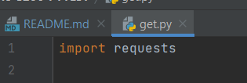
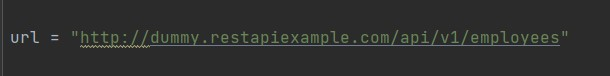
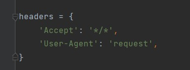
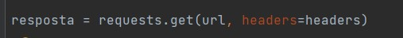
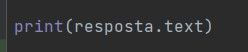
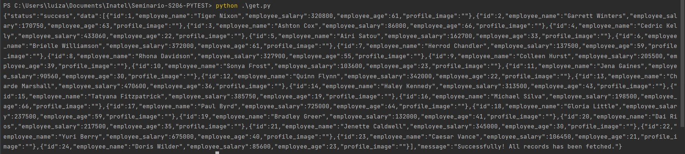
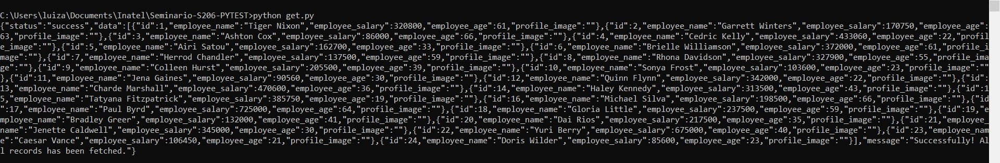
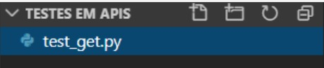
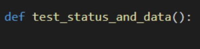
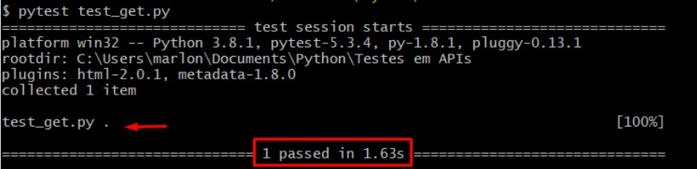

<h1 align="center"> Hello, Dev world!💻 </h1>

[](https://github.com/luizamonroe/Seminario-S206-PYTEST/actions/workflows/CI.yml)


## Menu

- [Sobre o Projeto](#sobre-o-projeto)
- [Equipe](#equipe)
- [Instalação](#instalação-das-ferramentas-necessárias-%EF%B8%8F)
   - [Pré-requisitos](#pré---requisitos-)
   - [Windows](#-windows-so-)
   - [Linux](#-linux-so)
   - [MacOS](#-macos)
- [Vantagens do Pytest](#vantagens-pytest)
- [Clonando o projeto](#vantagens-do-pytest)
- [Iniciando os testes de API](#iniciando-os-testes-de-api)
  - [Rodando o script](#para-rodar-o-script)
- [Criando um teste de API](#passo-a-passo)
- [Gerando report dos testes](#gerando-report-dos-testes)

## Sobre o Projeto
Projeto desenvolvido para o seminário da matéria Qualidade de software(S206) ministrada pelo professor Chris Lima no primeiro semestre de 2022.

Na realização deste seminário foi utilizada a ferramenta **Pytest**, visando a criação de testes de API.


## Equipe:
* 👧 Luiza Monroe
* 👦 Alvaro Breno 
* 👦 Leonardo Mendonça


## Instalação das Ferramentas necessárias 💻⚙️
Para saber mais sobre a ferramenta <a href="https://pypi.org/project/pip/"> Pytest </a>, você pode acessar a documentação e poder esclarecer quaisquer duvidas que surgirem. Mas segue em frente pro passo a passo! 

### Pré - Requisitos 🎯
Para instalar o Pytest é preciso ter também em sua máquina o <a href="https://pypi.org/project/pip/">PIP</a>, gerenciador de pacotes do Python.<br>
Normalmente, o PIP é instalado automaticamente se você:
- Está usando Python baixado de <a href="https://www.python.org/">python.org</a> ⁉
- Está usando IDE's como o <a href="https://www.jetbrains.com/pt-br/pycharm/">PyCharm</a>, que ja possui o PIP integrado e também uma fácil instalação do <a href="https://www.jetbrains.com/help/pycharm/pytest.html">Pytest</a>, direto em suas configurações de projeto.
- O <a href ="https://code.visualstudio.com/docs/python/testing">VSCode</a> também tem sua extensão com o Python e seu guia de instalação. 

### <p>💿 Windows S.O </p>
<p>⚠️Antes de tudo, você pode usar o CMD do Windows ou até mesmo o <a href="https://dicasdeprogramacao.com.br/como-instalar-o-git-no-windows/">Git</a> Bash para isso ⚠️</p>

<p>Step 1: Rode o seguinte comando para baixar o arquivo "get-pip.py": </p>

```bash
curl https://bootstrap.pypa.io/get-pip.py -o get-pip.py
```

<p>Step 2: Instalando PIP no windows: </p>

```bash
python(ou py) get-pip.py
```

<p>Step 3: Adicione PIP nas suas <a href="https://www.noticiastecnicas.com/variaveis-de-ambiente-do-sistema-e-do-usuario-no-windows-explicadas/">variáveis de ambiente</a> do Windows, para poder rodar o comando de qualquer lugar. </p>

#### Versão e atualização
- Para verificar se instalou corretamente e saber sua versão, rode o seguinte comando:
```bash
pip --version
```

- Para atualizar sua versão do PIP, rode o seguinte comando:
```bash
python -m pip install --upgrade pip
```

#### Instalando o Pytest
- 1º Com um simples comando você já instala o Pytest:
```bash
pip install -U pytest
```

- 2º Para saber a versão do Pytest, também é simples:
```bash
pytest --version
```

### 💿 Linux S.O 
Você pode seguir o passo-a-passo do <a href ="https://python.org.br/instalacao-linux/">python.org </a> para instalação do Python em Linux

### Instalando o Pytest
Step 1: 
```bash
sudo apt-get update
```

Step 2:
```bash
sudo apt-get install python-pytest
```

### 💿 MacOS
Você pode seguir o passo-a-passo do <a href ="https://python.org.br/instalacao-mac/">python.org </a> para instalação do Python em MacOS


## Vantagens do Pytest
* A sintaxe simples permite que pessoas de todos os níveis possam utilizá-lo sem dificuldade;
* Permite execução de testes em paralelo;
* Facilidade na troca da execução de um teste, um conjunto ou uma suíte completa;
* Detecta testes automaticamente baseando-se nos nomes dos arquivos e diretórios criados;
* Open source.

### Clonando o projeto 🔀
Agora é hora de baixar o projeto e poder testar um pouco dessa ferramenta de testes unitários.

- Com o terminal ainda aberto, navegue até a pasta onde deseja salvar o projeto e cole o seguinte comando:
```bash
git clone https://github.com/luizamonroe/Seminario-S206-PYTEST.git
```
**Pronto, tudo configurado! Agora é só escolher o seu IDE que preferir.** </p>


## Iniciando os testes de API
* Utilizaremos o <a href ="http://dummy.restapiexample.com/api/v1/employees">Dummy </a> pela simplicidade e praticidade na hora de implementar nossos scripts. Ele nos oferece rotas com todos os verbos HTTP apresentados inicialmente e nos permite buscar, criar, deletar e atualizar empregados (employees).
* Na IDE utilizada, crie um arquivo chamado **get.py**
* A biblioteca **requests** será utilizada para realizar as chamadas nas APIs, então devemos importá-la no nosso get.py:
* 
* Guardaremos o Dummy na variável url:
* 
* Precisamos criar um cabeçalho (header) informando que vamos realizar um request e que aceitamos diversos tipos de resposta do endpoint:
* 
* Para realizar a busca pelos empregados utilizando a biblioteca request, utilizaremos a função do verbo get, informando a url utilizada, e guardaremos essa informação em "resposta":
* 
* E para imprimirmos a variável, e analisarmos o conteudo do site utilizado:
* 

### Para rodar o script:
* Pelo terminal da própria IDE utilizada:
  * Rodar o comando **python get.py**, e o resutado deverá ser este:
  * 

* Pelo terminal do próprio computador:
  * Navegar até a pasta criada (no meu caso Documents\Inatel\Seminario-S206-PYTEST);
  * Rodar o comando **python get.py**, e o resutado deverá ser este:
  * 


## Criando um teste de API
* Os nomes dos scripts de teste do Pytest e seus métodos devem começar com test_ ou finalizar com _test.

* 

* Crie um método com o nome de preferência respeitando a nomenclatura citada.

* 

* Passe todo o conteúdo do seu script para o interior desse método através da indentação.

* Remova os prints e utilize asserts para validar os retornos da API.

* Agora execute o comando pytest test_get.py e veja o resultado.

* 

* Obs: O teste só deve passar caso as condições sejam verdadeiras.

## Gerando report dos testes

* Para gerar os reports dos teste você precisa fazer os seguintes passos:
1) Se quiser html reports
```bash
pip install pytest-html
```

* Apos instalação ao executar o teste pelo cmd ou terminar da IDE que escolheu acrescente o comando  --html=report.html, veja:
```bash
pytest  --html=report.html
```

* Obs: O comando pytest executa todos os testes da sua suíte de testes no diretório raíz do projeto.

2) Se quiser por json-report
```bash
pip install pytest-json-report — upgrade
```

* Após a instalação ao executar os testes pelo cmd ou terminal da IDE que escolheu acrescente o comando --json-report, veja:
```bash
pytest --json-report 
```

## Arquivos :open_file_folder:
<!--ts-->
* :page_facing_up: get.py
* :page_facing_up: test_get.py
* :page_facing_up: test_put.py
<!--te-->

